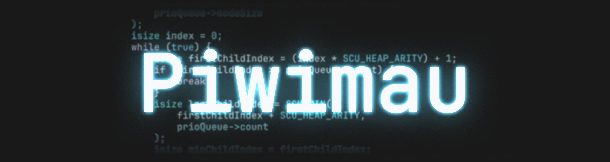
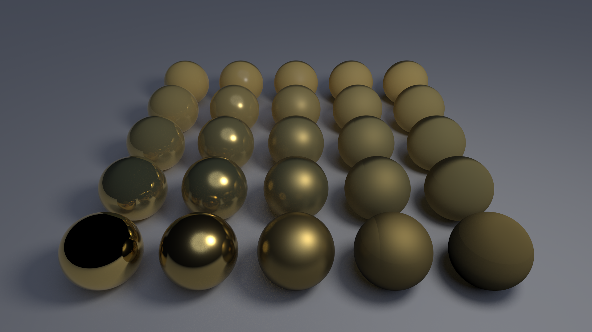

  

<h1 align="center">👋 Hey, I'm Philipp!</h1>
<h3 align="center">CS Student | Systems Programming Enthusiast | Hobby Photographer</h3>

I'm a computer science student from Germany, currently pursuing my master's
degree. I enjoy deep dives into topics such as assembly and instruction set
architectures, compilers, operating systems, pointers and memory management, as
well as hardware acceleration and computer graphics. Whenever I'm not working on
personal projects, you'll likely find me behind a camera, capturing the beauty
of the world around me.

## What I'm Working On

### Software Raytracer & Rasterizer

<table>
  <tr>
    <td valign="middle" width="55%">
      

        Following the book <a href="https://gabrielgambetta.com/computer-graphics-from-scratch/">Computer Graphics from Scratch</a>,
        I'm building a raytracer and rasterizer from scratch to learn the
        fundamentals of computer graphics. Implementing everything in software,
        from ray intersection and shading to the rasterization pipeline, allows
        me to gain a much deeper understanding of what actually happens between
        a scene description and the final pixels shown on a monitor.
      

    </td>
    <td valign="middle" width="45%">
      
    </td>
  </tr>
</table>

Find out more in the
[repository](https://github.com/Piwimau/computer-graphics-from-scratch).

## What's Next

After using C and C# as my main languages for the past two to three years, I
recently started learning C++ and have been pleasantly surprised: It feels like
a nice middle ground between the low-level control provided by C and the
high-level abstractions available in C#. I'm looking forward to learning more
about the language and modern idioms for writing high-quality, efficient
software.

I have lots of ideas for projects I want to work on in the future, including
writing an interpreter and compiler for a custom programming language. I also
plan to catch up on a few years of [Advent of Code](https://adventofcode.com/),
which I can highly recommend to anyone wanting to improve their problem-solving
skills.

## Tech Stack & Experience

### Languages

### Frameworks & Libraries

### Infrastructure & Tooling

Alongside my studies, I've built several projects, such as small games and
simulations rendered with OpenGL and a GPU-accelerated audio filtering pipeline
using OpenCL, FFTW and VkFFT. I've also gained hands-on experience in embedded
systems with STM32 and Raspberry Pi, including real-time development with
µC/OS-II. As part of my bachelor thesis, I developed an internal industrial
automation tool based on .NET, C# and WPF, covering requirements engineering,
design, unit testing and benchmarking.

## Contact Me

Always happy to chat about systems programming, photography, or anything in
between! 😉

